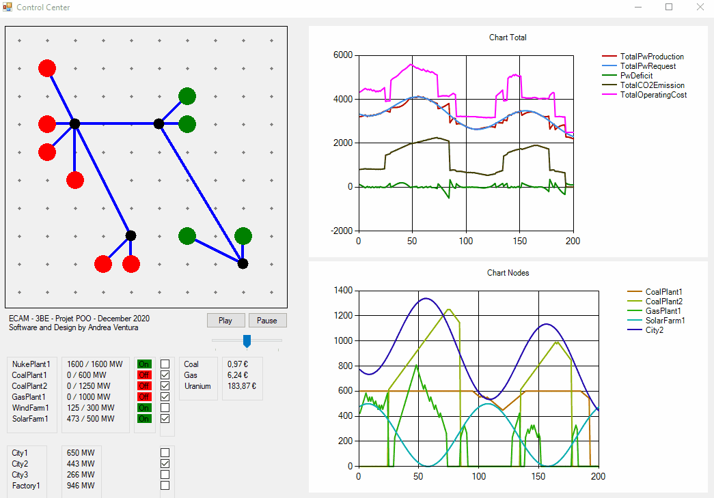

# POO - Simulateur de réseaux électrique

This platform simulate the behaviour of an electrical grid at a country scale. The aim is to simulate the dynamic behaviour of a set of electrical power production centers and power consummers.
Thanks to this platform, researchers can develop automatic regulation schemes of the network in order to simulate disasters, optimise buy/sell markets with neighboring countries, study investement oportunity and reduce the environmental impact of the grid.

The platform offer a series of classes allowing researchers to build their own network, along with a broad implementation of most of these classes for presentation purpose. It is possible to create your own plants/consumers/fuels/... classes fitting your need by inheriting from the corresponding abstract superclass. The following documentation describe the most important part of the platform.

## Graphical User Interface

At runtime, the exemple program available in the files run this window, displaying various information about the grid and its components. It is a ControlCenter object, inheriting from the Windows Form object, providing all the graphical and interactivity part of the platform. It's not involved in any data calculation of the grid or its components. Its only role is to repeatedly update the grid with a timer attached to it, and render in a user-friendly maner the data the grid has calculated. 

At the top left is a map of the nodes of the grid with coordinate <0,0> at the top left of the map. Below this map are two buttons, play and pause, letting the user stop the simulation and resume it at will, along with a trackbar allowing to set the speed of the simulation from slow, normal and fast. At the bottom left are all the Plant nodes and Consumer nodes of the grid along with various information about their current state. The fuel attached to the grid are also displayed along with their current price. Note the small checkbox attached to each of these nodes, they allow for the display/hiding of that node current power production/consumption on the "Node Chart" at the bottom right. Finally, at the top right is located the chart of the total power production, power consumption, CO2 emission,... of the whole grid. Note that the content of the ControlCenter automatically display the content of the grid without the need to adjust the ControlCenter itself.

   
  <em>Click the image for full resolution</em>

## Class Diagram

Here is presented the Class Diagram of the classes included in the platform. Lets go trough this diagram in steps:
- The two main components of our platform are the ControlCenter and the Grid object. The ControlCenter aggregate a Grid object and display its information, as explained in the GUI section above. The Grid itself is an aggregation of many differents Node object, PowerLine, and Fuel. It gather the relevant informations about these object on a timely basis and updates them accordingly.
- The bottom half part of our diagram is occupied by the Node Super-Class and all the sub-Classes inheriting from it. A Node can be any object located at a point on the grid and taking part in its simulation. Here we have created a few basic implementation of this Node Super-Class, wich are:
  -Plants, feeding the Grid with electrical power.
  -Consumer, drawing power from the grid.
  -Junction, wich are used to link together several Nodes and concentrate/distribute power from/along many power lines.
- There are two Interfaces included in the platform; IMarket, implemented by the Fuel class, which randomize the price value of the Fuel object over time, and IWeather, implemented by the Node class, wich provide each Node object with a few weather parameters such as sunshine and wind.
- The Junction and PowerLine Classes do not have any functionnal implementation, they are just provided for graphical purposes.
- The classes and most of the important methods of the platform come with a little description of their function in the program files.

   
  <em>Click the image for full resolution</em>

## Sequence Diagram

This Sequence Diagram gives a preview of the most important functionality of the platform, the regulation of the plants power production based on the consumers power request.

   
  <em>Click the image for full resolution</em>

## Contributor

Andrea Ventura, student at ECAM Brussels Engineering School.

##
